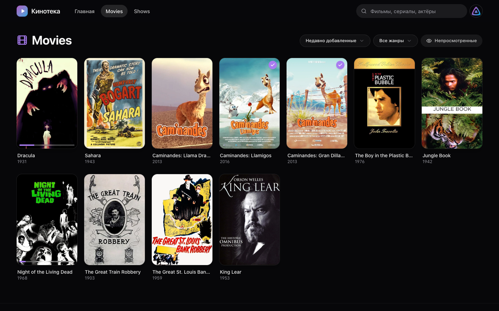
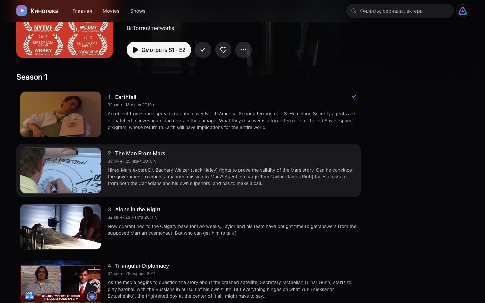

# Кинотека — веб-клиент для Jellyfin

Кинотека — альтернативный веб-клиент для медиасервера [Jellyfin](https://jellyfin.org),
предназначенный для просмотра фильмов, сериалов и прочего видео в браузере.
Приложение заменяет встроенный веб-клиент Jellyfin в части просмотра и не затрагивает
администрирование: панель управления, настройки профиля, а также разделы музыки,
ТВ и книг открываются во встроенном клиенте.


## Возможности

- **Главная страница** — витрина новинок с автоматическим пролистыванием, разделы
  «Продолжить просмотр» и «Следующие серии», новые поступления каждой медиатеки.
- **Медиатеки** — сетка с постраничной подгрузкой при прокрутке, сортировкой,
  фильтрами по жанру и непросмотренному. Медиатеки смешанного содержимого
  (например, спорт или видеокурсы) отображаются по папкам — в соответствии
  со структурой каталогов на диске.
- **Страницы фильмов, сериалов и персон** — описание, сведения о файле
  (разрешение, HDR, звуковые дорожки), актёрский состав, похожие произведения,
  сезоны и серии, фильмография.
- **Поиск** по фильмам, сериалам, сериям и персонам с выдачей по мере ввода.
- **Проигрыватель**:
    - продолжение просмотра с места остановки (позиция хранится в Jellyfin
      и доступна во всех клиентах);
    - миниатюры кадров при перемотке;
    - выбор звуковой дорожки и субтитров без перезагрузки страницы;
    - пропуск заставки и титров (при наличии сегментов, найденных плагином);
    - автоматический переход к следующей серии;
    - режим «картинка в картинке», AirPlay, горячие клавиши.
- **Вход** по имени и паролю пользователя Jellyfin либо по коду Quick Connect;
  подключение другого устройства (телевизора, телефона) по коду с его экрана.
- **Отметки** «просмотрено» и «избранное», ссылки на IMDb, TMDB и Кинопоиск.
- Интерфейс на русском языке, адаптивная вёрстка для компьютера, планшета
  и телефона.

|                                            |                                               |
| ------------------------------------------ | --------------------------------------------- |
|  |           |
|      |  |

## Принцип работы

Приложение построено на Laravel 13, Inertia 3, React 19, Tailwind CSS 4 и shadcn/ui.
Сервер приложения выступает посредником между браузером и REST API Jellyfin:
страницы формируются из ответов Jellyfin, собственной базы пользователей нет.
Проверку пароля выполняет Jellyfin, приложение хранит выданный им токен в сессии.

Видеопоток и изображения браузер получает непосредственно от Jellyfin — через
сервер приложения проходят только страницы и служебные запросы проигрывателя.

Особое внимание уделено нагрузке на медиасервер. Браузер сообщает, какие кодеки
он поддерживает, и на их основе формируется профиль устройства: совместимые файлы
воспроизводятся без обработки, а при несовместимом контейнере (например, MKV)
выполняется только перепаковка в HLS без перекодирования видео. Это позволяет
смотреть 4K HEVC на серверах, не способных перекодировать такое видео.

Подробное описание — в документе [«Архитектура»](docs/architecture.md).

## Требования

- PHP 8.4 или новее с расширениями `intl` и `pdo_sqlite`, Composer 2;
- Node.js 22 или новее;
- Jellyfin 10.10 или новее (проверено на 12.1).

Для воспроизведения 4K HEVC без перекодирования требуется браузер с поддержкой
HEVC: Safari, а также Chrome или Edge на macOS и Windows с аппаратным декодированием.

## Установка для разработки

```bash
git clone https://github.com/kamabyte/jellyfin-web.git
cd jellyfin-web
composer setup     # зависимости, файл .env, ключ приложения, база, сборка
composer dev       # сервер разработки и Vite
```

Адрес сервера Jellyfin задаётся в файле `.env` (см. «Конфигурация»). При отсутствии
собственного сервера можно использовать публичный демонстрационный сервер:
`JELLYFIN_URL=https://demo.jellyfin.org/stable`, пользователь `demo` без пароля.

## Конфигурация

| Переменная             | Назначение                                                                   | По умолчанию            |
| ---------------------- | ---------------------------------------------------------------------------- | ----------------------- |
| `JELLYFIN_URL`         | Адрес Jellyfin для запросов сервера приложения                               | `http://localhost:8096` |
| `JELLYFIN_PUBLIC_URL`  | Адрес Jellyfin для браузера: видео, изображения, ссылки во встроенный клиент | значение `JELLYFIN_URL` |
| `JELLYFIN_CLIENT`      | Название клиента в разделе «Устройства» Jellyfin                             | значение `APP_NAME`     |
| `JELLYFIN_MAX_BITRATE` | Верхний предел битрейта, бит/с                                               | `200000000`             |
| `JELLYFIN_TIMEOUT`     | Тайм-аут запросов к Jellyfin, с                                              | `15`                    |
| `SESSION_LIFETIME`     | Срок хранения входа, мин                                                     | `43200` (30 дней)       |

Если приложение открывается по HTTPS, `JELLYFIN_PUBLIC_URL` также должен
использовать HTTPS: браузер блокирует загрузку видео по HTTP со страниц,
открытых по HTTPS.

## Развёртывание

Приложение распространяется в виде Docker-образа `ghcr.io/kamabyte/jellyfin-web`,
который собирается GitHub Actions при каждой отправке изменений
([`image.yml`](.github/workflows/image.yml)). Образ содержит PHP-FPM и nginx
([serversideup/php](https://serversideup.net/open-source/docker-php/)),
порт контейнера — 8080, проверка работоспособности — `/up`.

Порядок развёртывания в [Dokploy](https://dokploy.com), включая выкатку
одной командой и откат, описан в [`deploy/dokploy/README.md`](deploy/dokploy/README.md).

## Контроль качества

```bash
composer test          # Pint, PHPStan (уровень 7), тесты Pest
npm run check          # линтер и форматирование фронтенда (vite-plus)
npm run types:check    # проверка типов TypeScript
composer ci:check      # всё перечисленное — так же, как в CI
```

Тесты не обращаются к сети: ответы Jellyfin подменяются (`Http::fake()`),
а любой незаглушённый запрос считается ошибкой.

## Лицензия

Проект распространяется по лицензии [MIT](LICENSE). Jellyfin — товарный знак
соответствующих правообладателей; проект не связан с командой Jellyfin.
